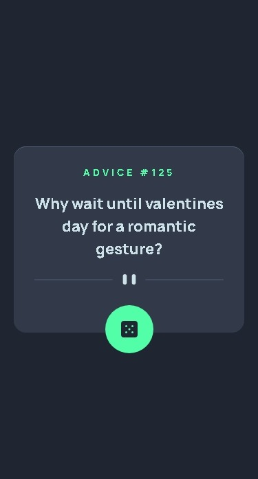
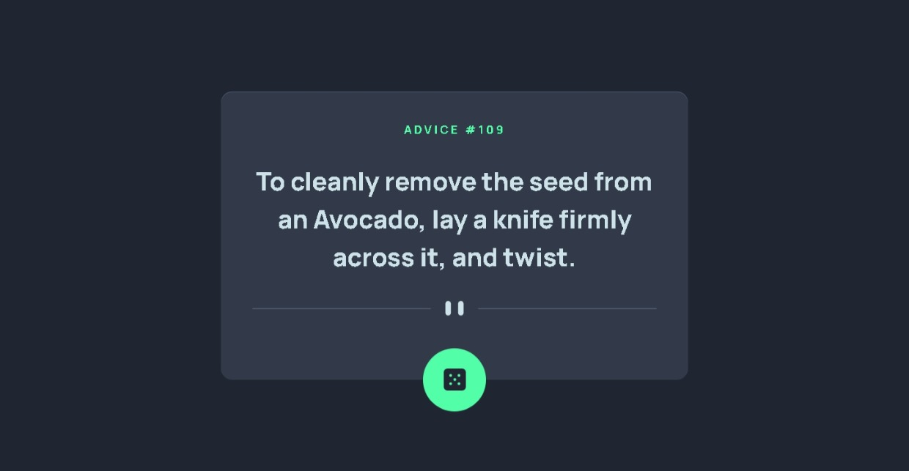
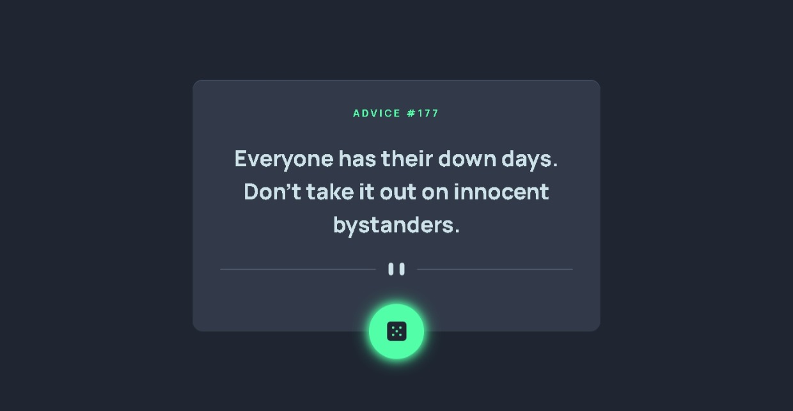

# Frontend Mentor - Advice Generator App

This is a solution to the [advice-generator-app-main on Frontend Mentor](https://www.frontendmentor.io/challenges/advice-generator-app-QdUG-13db). Frontend Mentor challenges help you improve your coding skills by building realistic projects

## Table of contents

- [Overview](#overview)
  - [Screenshot](#screenshot)
  - [Links](#links)
- [My process](#my-process)
  - [Built with](#built-with)
  - [What I learned](#what-i-learned)
  - [Continued development](#continued-development)
- [Author](#author)

## Overview

### Screenshot

These are my screenshots showing how the project turned out.

- Mobile design:



- Desktop design:



- Active states:



### Links

- Solution URL: [My Solution](https://github.com/gillaercio/advice-generator-app-main)
- Live Site URL: [My Solution](https://gillaercio.github.io/advice-generator-app-main/)

## My process

### Built with

- Semantic HTML5 markup
- CSS custom properties
- Flexbox
- CSS Grid
- Mobile-first workflow
- JavaScript

### What I learned

I took advantage of this project to practice using **BEM** with HTML, **Reset CSS** and  **Variables** with **CSS** and **DOM** and **APP consumption** with **JavaScript**:

BEM (Block Element Modifier)

```html
<article class="advice">
  <p class="advice__id">
    Advice #<span id="advice-id">...</span>
  </p>

  <blockquote class="advice__text" aria-live="polite">
    <p id="advice-text">"Loading advice..."</p>
  </blockquote>

  <div class="advice__divider" aria-hidden="true"></div>

  <button type="button" class="advice__button">
    
    <span class="visually-hidden">Generate New Advice</span>
  </button>
</article>
```

Reset CSS

```css
*,
*::before,
*::after {
  margin: 0;
  padding: 0;
  box-sizing: border-box;
}
```

Variables

```css
:root {
  --Blue-200: hsl(193, 38%, 86%);
  --Green-300: hsl(150, 100%, 66%);

  --Blue-600: hsl(217, 19%, 38%);
  --Blue-900: hsl(217, 19%, 24%);
  --Blue-950: hsl(218, 23%, 16%);

  --manrope: 'Manrope', sans-serif;

  --text: 800 1.4rem/120% var(--manrope);
  --text-lg: 800 2.2rem/150% var(--manrope);
}
```

APP Consumption and DOM

```js
//...
async function getAdvice() {  
  button.disabled = true;
  
  try {
    const response = await fetch(
      `https://api.adviceslip.com/advice?timestamp=${Date.now()}`
    );
    const data = await response.json();
    adviceText.style.opacity = "0";

    setTimeout(() => {
      adviceId.textContent = data.slip.id;
      adviceText.textContent = data.slip.advice;
      adviceText.style.opacity = "1";

      button.disabled = false;
    }, 300);

  } catch {
    adviceText.textContent = "Failed to load advice.";
    adviceText.style.opacity = "1";
  }
}
button.addEventListener("click", getAdvice);

getAdvice();
```

### Continued development

I would like to improve the use of the **HTML**, **CSS** and **JavaScript**.

## Author

- Frontend Mentor - [@gillaercio](https://www.frontendmentor.io/profile/gillaercio)
- Github - [My Github](https://github.com/gillaercio)
- LinkedIn - [My LinkedIn](https://www.linkedin.com/in/gildman-la%C3%A9rcio/)